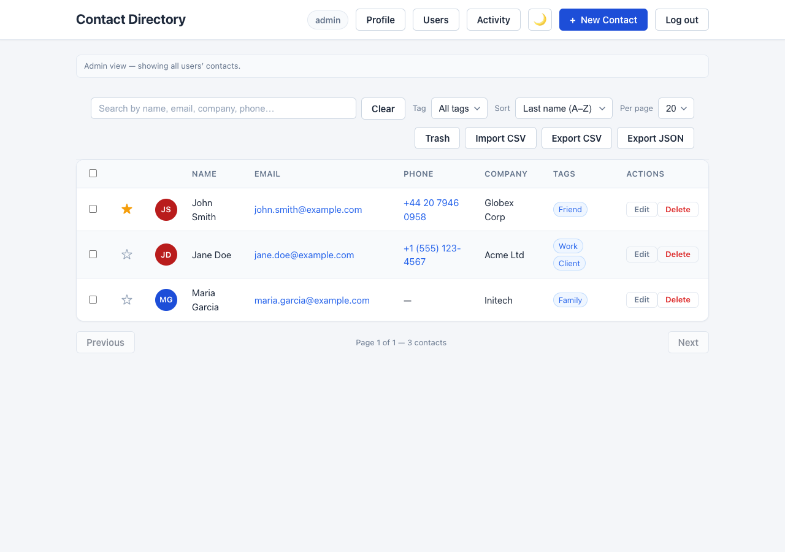
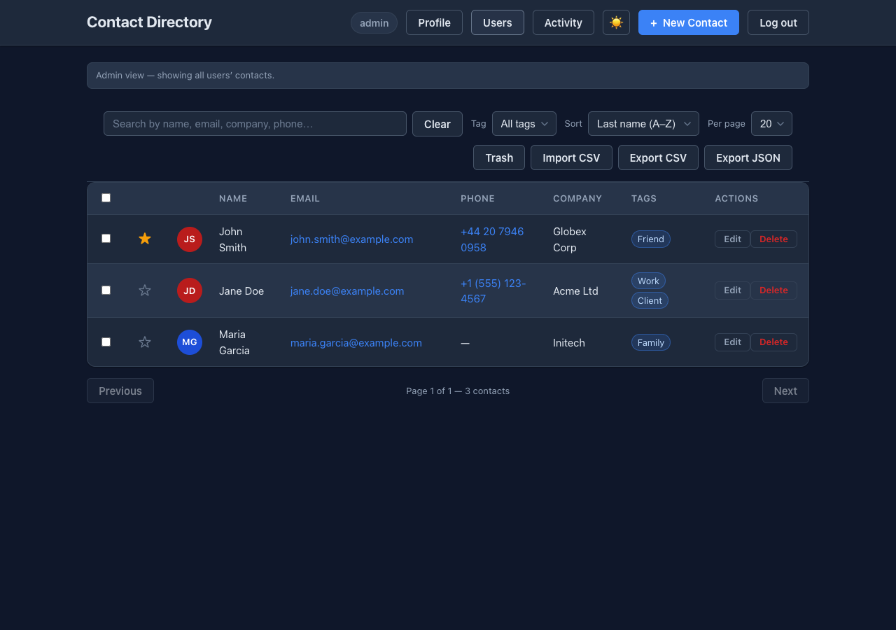
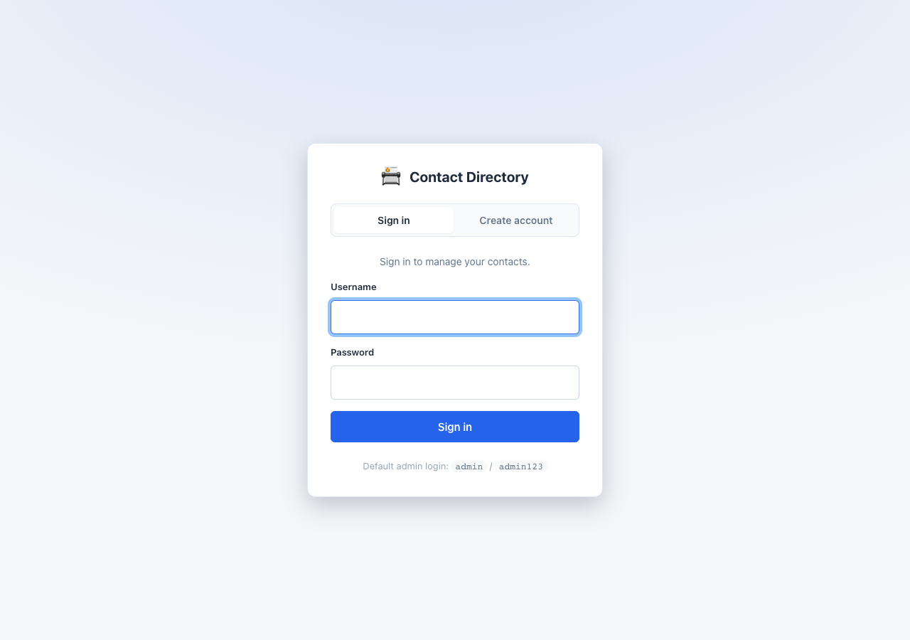
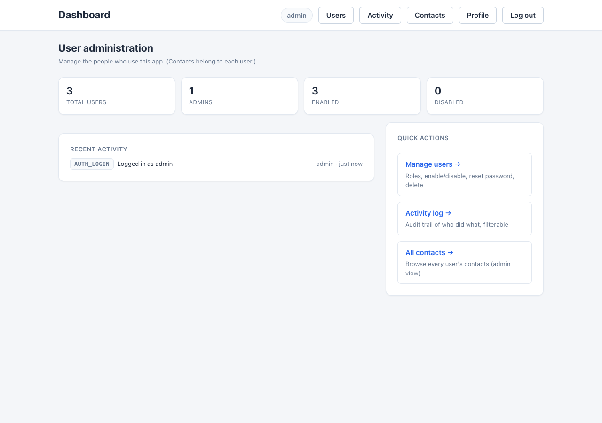
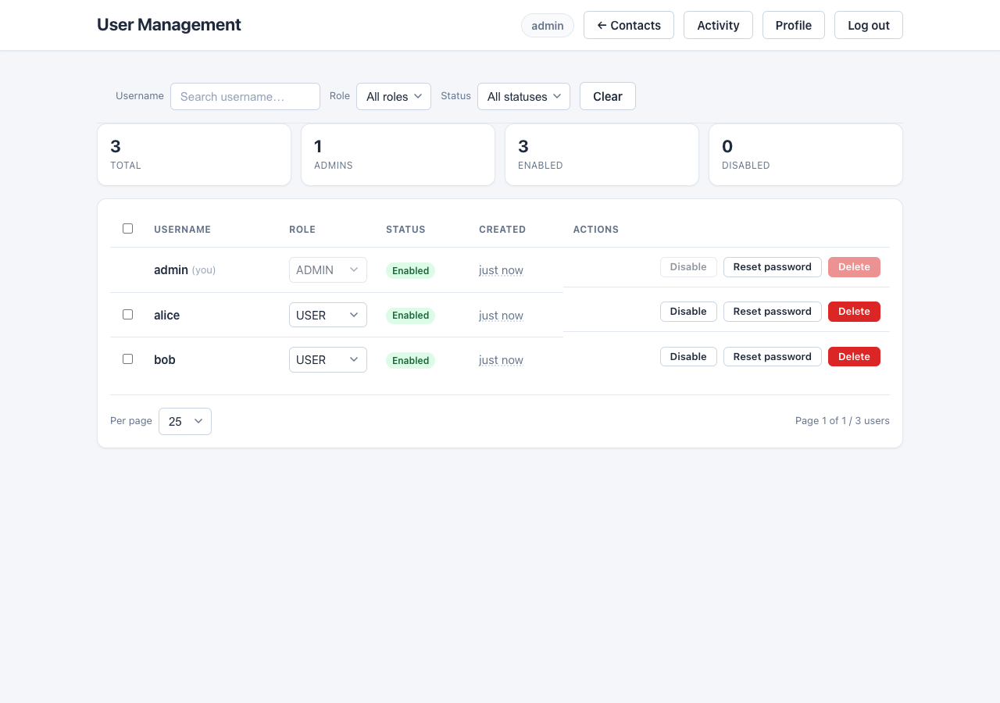
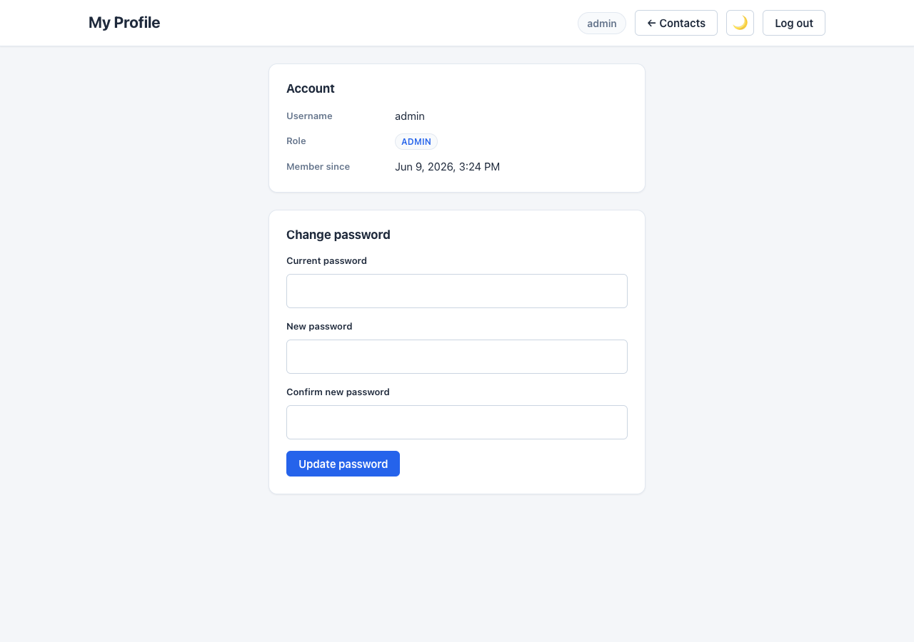
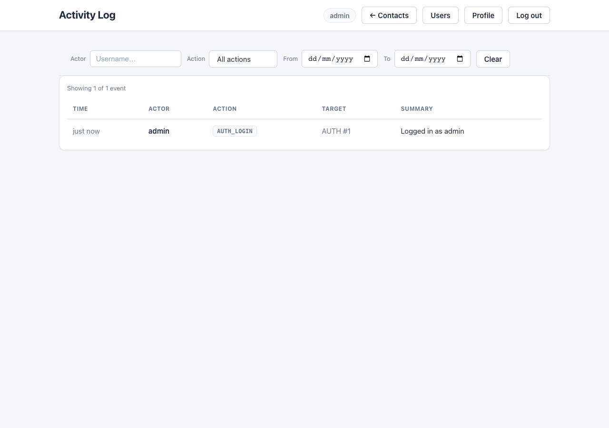

# Contact Directory — Features

A complete map of what the app does, grouped by area. Built incrementally, each area committed
separately. **233 tests passing** (plus three browser e2e suites — an H2 UI walkthrough, a Postgres-backed one, and a silent-refresh check). For setup and API reference see the [README](README.md); for a
click-through tour see [docs/WALKTHROUGH.md](docs/WALKTHROUGH.md).

Legend: ✅ done · 🔄 in progress · ⬜ planned

---

## Core contact management

| # | Feature | Status |
|---|---------|--------|
| 1 | Search & filter — live search by name, company, phone, email | ✅ |
| 2 | Tags / categories — label contacts (Friend, Work, Client, Family) + filter | ✅ |
| 3 | Favourite / star — pin important contacts to the top | ✅ |
| 4 | Import / export — CSV import (bulk add), export CSV/JSON | ✅ |
| 5 | Avatar / initials — auto-coloured initials circle, or photo upload | ✅ |
| 6 | Sort controls — name A–Z, recently added, etc. | ✅ |
| 7 | Contact detail modal — full profile card (details, notes, links) | ✅ |
| 8 | Notes field — free-text notes per contact | ✅ |
| 9 | Click-to-action — `tel:` / `mailto:` links | ✅ |
| 10 | Dark / light mode toggle — saved to `localStorage` | ✅ |

Same screen in **dark mode** (toggle saved per browser):

## Safe management

| Feature | Status |
|---------|--------|
| Soft delete + Trash + Undo — `DELETE` soft-deletes; `GET /trash`, restore, delete-forever; Undo toast | ✅ |
| Bulk actions — multi-select rows; bulk favourite / tag / delete (`POST /bulk/*`) | ✅ |
| Optimistic concurrency — `@Version` on contacts; stale edits return `412 Precondition Failed` | ✅ |

## Authentication

| Feature | Status |
|---------|--------|
| JWT login & registration — stateless bearer tokens; styled sign-in / create-account page | ✅ |
| Refresh tokens — short-lived access JWT (15m) + opaque rotating refresh token (14d, hashed at rest); silent refresh in the UI | ✅ |
| Real logout & revocation — server-side session kill on logout; reuse (theft) detection revokes the whole session family; password change/reset, disable & delete revoke sessions | ✅ |
| Spring Security — protected REST API; JSON `401` / `403` responses | ✅ |
| Brute-force lockout — repeated failed logins lock an account (`423 Locked`) | ✅ |

## Roles & access control

| Feature | Status |
|---------|--------|
| Roles — `USER` and `ADMIN`, enforced with method security | ✅ |
| Per-user ownership — a `USER` sees/manages only their own contacts; an `ADMIN` sees all | ✅ |
| Per-owner email uniqueness — two users can each have the same email; cross-user access → `404` | ✅ |
| Admin-only permanent delete — irreversible purge restricted to admins | ✅ |
| Admin user management — list users, change role, enable/disable, reset password, delete | ✅ |
| Admin dashboard — admins land on a user-administration dashboard (user stats + recent activity + quick links), not the contacts page | ✅ |
| Admin owns no contacts — the admin is a super-user that sees everyone's contacts (an "admin view"); contacts belong to each user | ✅ |
| Self-protection — an admin can't demote, disable or delete their own account | ✅ |

The admin landing page is **user administration**, not contacts:

## Account self-service

| Feature | Status |
|---------|--------|
| Change password — current + new with confirmation | ✅ |
| Profile page — username, role and member-since | ✅ |

## Audit log (edit history)

| Feature | Status |
|---------|--------|
| Append-only audit trail — records who did what and when | ✅ |
| Coverage — contact create/edit/delete/restore/bulk/import, user-management actions, logins & registrations | ✅ |
| Admin Activity page — `GET /api/v1/audit`, newest-first, filterable by actor and action | ✅ |
| Resilient recording — an audit-write failure never breaks the underlying action | ✅ |

## Observability (health & metrics)

| Feature | Status |
|---------|--------|
| Spring Boot Actuator — `health`, `info`, `metrics` exposed over HTTP | ✅ |
| `/actuator/health` public — orchestration liveness/readiness probes (no token) | ✅ |
| `/actuator/metrics` secured — requires a bearer token | ✅ |
| Health detail shown to authenticated callers only (`show-details: when-authorized`) | ✅ |

---

## Admin & UI enhancements

Admin-console UX improvements delivered as CD-006…CD-014 via the Git Flow:

| Feature | Status |
|---------|--------|
| Users table — search + role/status filter | ✅ |
| Users table — sortable columns | ✅ |
| Users page — summary stats bar (total / admins / enabled / disabled) | ✅ |
| Relative timestamps (absolute on hover) across Users + Activity | ✅ |
| Copy-to-clipboard buttons (username / email) | ✅ |
| Styled confirmation dialog (replaces native confirm) | ✅ |
| Users table — bulk select + bulk actions | ✅ |
| User detail modal (details + recent activity) | ✅ |
| Activity log — actor + multi-select action + date-range filters | ✅ |
| Users table — client-side pagination (page-size + Prev/Next) | ✅ |

## Platform notes

- **Stack:** Spring Boot 3.5.14, Java 21, Spring Data JPA + Hibernate, Spring Security + JWT, vanilla
  HTML/CSS/JS frontend, springdoc OpenAPI.
- **Persistence:** H2 **file mode** (`./data/contacts.mv.db`) by default — data survives restarts;
  tests use an isolated in-memory H2. An optional **PostgreSQL + Flyway** profile (`postgres`) is
  available for durable, production-like deployment (two-container `docker-compose`) — see the README.
- **Tests:** **233** across 20 classes (unit + full-stack + HTTP e2e), incl. cross-user isolation,
  role enforcement, optimistic concurrency, account self-service, lockout, the refresh-token
  lifecycle, HSTS, audit and Actuator health/metrics coverage. Three tag-excluded **browser e2e**
  suites run only on `master`/`develop` via [`e2e.yml`](.github/workflows/e2e.yml): `PlaywrightE2eTest`
  (full UI walkthrough on H2, with screenshots + video), `PlaywrightPostgresE2eTest` (Testcontainers
  PostgreSQL — proves the real `postgres` profile + the `bytea` photo round-trip in a browser), and
  `PlaywrightSilentRefreshE2eTest` (proves silent token refresh past access-token expiry).

## Advanced scaling (roadmap)

> The foundation (durable Postgres persistence) is **implemented**; the scaling ladder and service
> decomposition below are still **planned**. See [`docs/RELEASE-AND-DEPLOYMENT.md`](docs/RELEASE-AND-DEPLOYMENT.md)
> and tickets CD-024 / CD-025.

**Durable, scalable persistence (Postgres + Flyway)** ✅ *(CD-024)* — a `postgres` Spring profile runs
on PostgreSQL with **Flyway**-owned, versioned schema (`ddl-auto: validate`); a two-container
`docker-compose.yml` (app + postgres + `pgdata` volume) makes data survive restarts. Local dev and
tests still use embedded H2 (Flyway off), so the inner loop is unchanged. This is the foundation that
makes the sub-features below possible. Note: you can't scale Postgres by cloning identical write
containers (it's stateful) — the ladder below is how you actually handle load, cheapest → heaviest.

| Sub-feature | What | Status |
|---|---|---|
| App-tier scale-out | Run many app containers against **one** Postgres (the app is usually the bottleneck) | ⬜ |
| Vertical scaling | More CPU / RAM / disk-IO for the Postgres container | ⬜ |
| Connection pooling | PgBouncer in front — share a few DB connections across many clients | ⬜ |
| Read replicas | Primary (writes) + read-only replica containers; route reads to replicas | ⬜ |
| HA / failover | Patroni + replicas — auto-promote on primary failure (uptime, not throughput) | ⬜ |
| Sharding / multi-primary | Citus or app-level sharding to scale **writes** — last resort, rarely needed | ⬜ |

**Service decomposition — split API by domain (microservices)** ⬜ — break the monolith into
independently-scalable services behind an API gateway, so each domain scales/deploys on its own
(a *different axis* from the horizontal scale-out above):

| Service | Owns | Endpoints |
|---|---|---|
| auth-service | login / register / token validate | `/api/v1/auth/*` |
| contacts-service | contact CRUD, import/export, photos | `/api/v1/contacts/*` |
| admin-service | user management + audit log | `/api/v1/users/*`, `/api/v1/audit/*` |
| api-gateway | path routing, shared JWT validation, rate limiting | — |

*Trade-off: only worth it at real scale / multiple teams. Prefer horizontal scale-out (above) first;
the DB split (shared vs per-service) is the hard part.*

## Possible next steps

- ⬜ Hibernate Envers — field-level revision history with one-click restore
- ⬜ Forgot-password flow (needs SMTP wired)
- ⬜ Richer contacts — multiple emails/phones/addresses, vCard import/export
