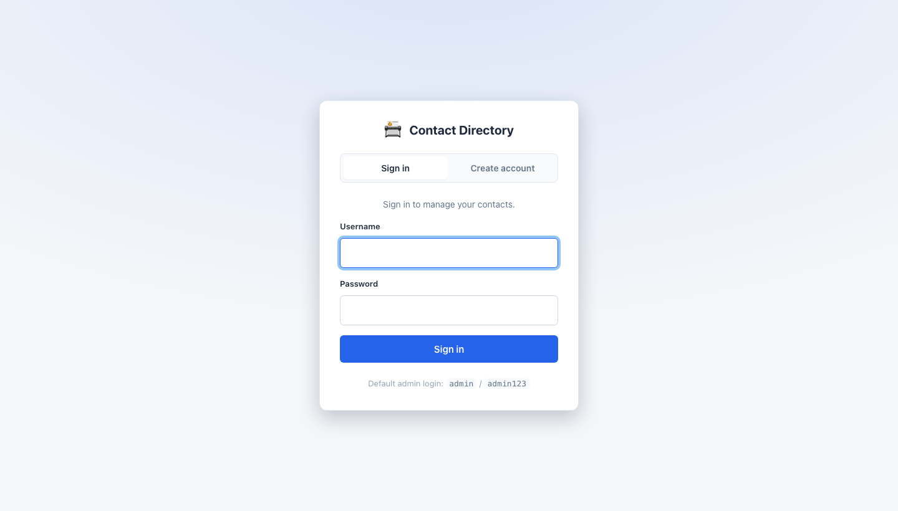
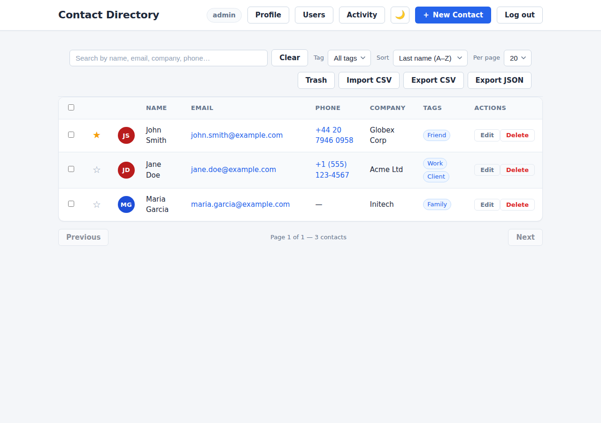
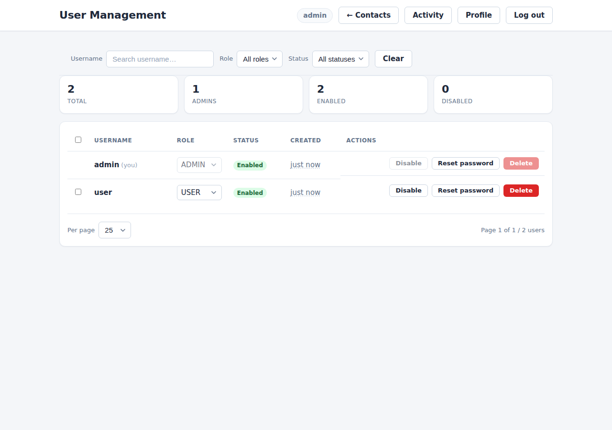
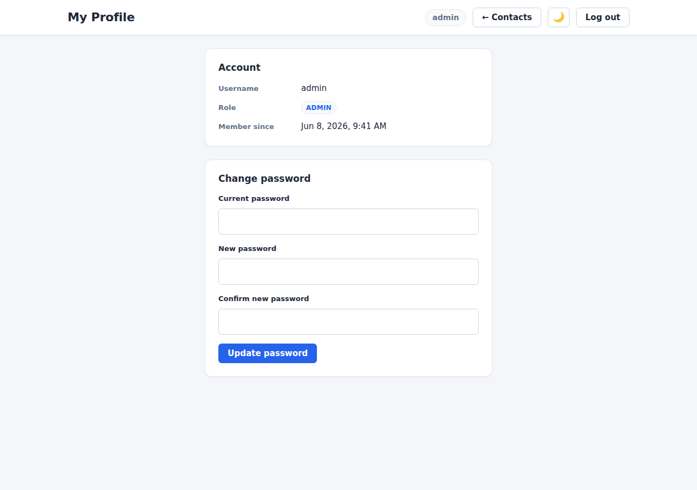
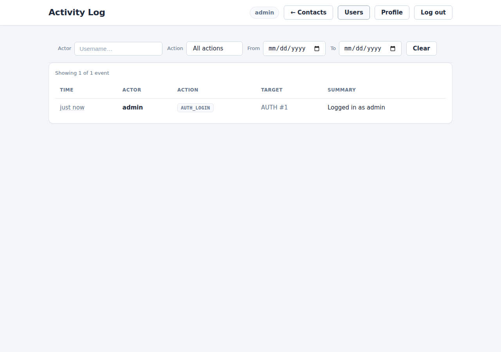
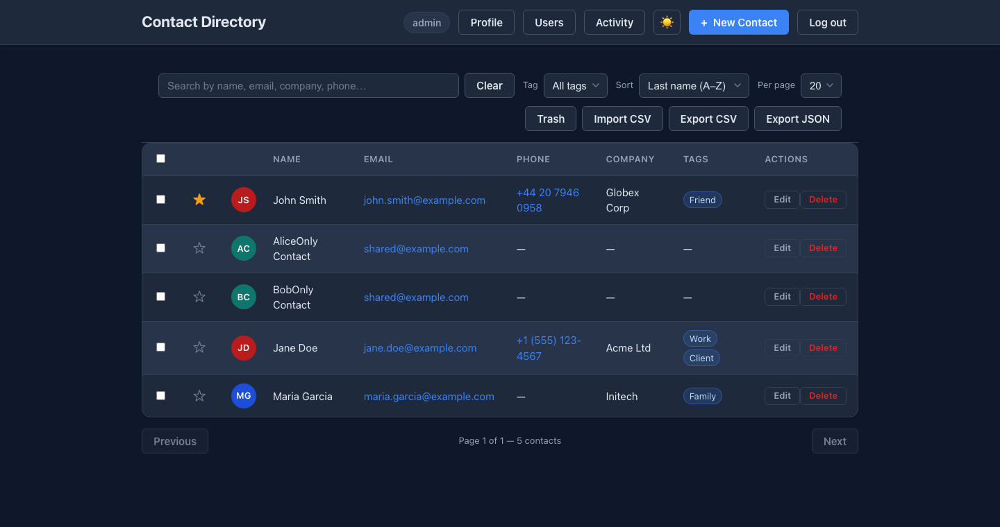

# Walkthrough

A quick visual tour of the Contact Directory web UI. Start the app with `./mvnw spring-boot:run`
and open **http://localhost:8080/**.

## 1. Sign in

Every page is gated — visiting the app with no session redirects you to the sign-in screen. Log in
with the seeded admin (`admin` / `admin123`) or a seeded sample user (`alice` / `alice123`,
`bob` / `bob123`), or use the **Create account** tab to self-register a new `USER`.

- Failing the password too many times in a row temporarily **locks the account** (HTTP `423`); a
  successful login clears the counter.
- On success you're issued a JWT (held in the browser). **Admins land on a dashboard** (user
  administration — user stats, recent activity, quick links), since the admin's job is managing users,
  not owning contacts. **Regular users land on their contacts.** An admin viewing the contacts page
  sees *everyone's* contacts (an "Admin view" banner makes this explicit).

## 2. Manage contacts

The home screen lists contacts with live search, tag filtering, sorting and pagination. Favourites
are pinned to the top. From here you can create, edit, delete (soft-delete to **Trash**), bulk-select
rows, import/export CSV/JSON, and upload photos.

Ownership is enforced server-side:

- A **USER** sees and manages **only their own** contacts.
- An **ADMIN** sees **everyone's** contacts (the view above).
- Two different users can each keep a contact with the same email; accessing a contact you don't own
  returns `404`.

## 3. Admin: user management

Admins get a **Users** link in the header opening the user-management screen. Here an admin can
change a user's role, enable/disable an account, reset a password, or delete a user. The table also
offers **search + role/status filters**, **sortable columns**, a **summary stats bar**,
**bulk select + bulk actions**, **client-side pagination**, and a **detail modal** (click a row).

Self-protection prevents lock-outs: an admin **cannot** demote, disable or delete their **own**
account (those controls are greyed out on the admin's own row).

## 4. Profile & change password

Every signed-in user has a **Profile** page showing their account details and a self-service
**change-password** form (current password + new password with confirmation).

## 5. Admin: activity log

Admins also get an **Activity** link opening the audit trail — an append-only log of who did what
and when (contact create/edit/delete/restore, bulk and import actions, user-management changes, and
logins/registrations). It can be filtered by actor, **action (multi-select)** and a **date range**.

## Dark mode

Every page supports a **dark / light** theme via the 🌙 / ☀️ toggle in the header; your choice is
saved per browser.

---

> Screenshots are generated from the running app. To refresh them, re-run the app and recapture the
> login, contacts, users and profile screens into `docs/screenshots/`.
